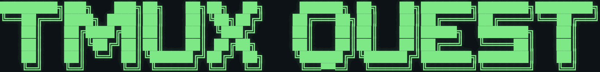
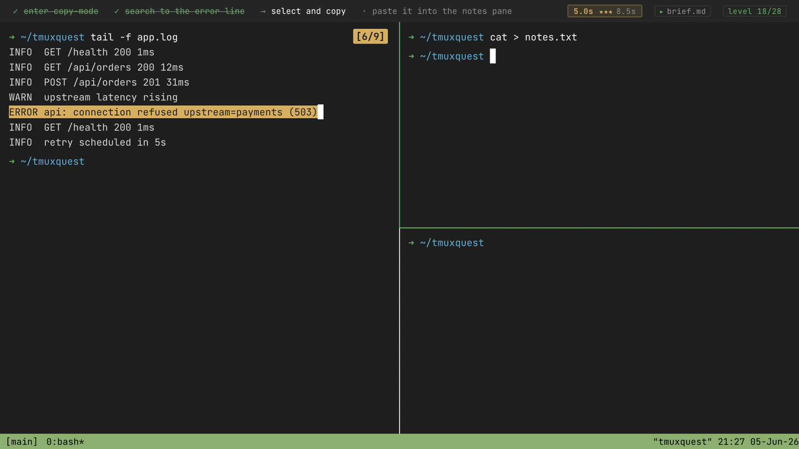

<p align="center">
  
</p>

<p align="center">A browser game that teaches <code>tmux</code></p>

<h4 align="center">
  <a href="https://tmuxquest.com" target="_blank" rel="noopener noreferrer">Play at tmuxquest.com</a>
</h4>

<p align="center">
  
</p>

```bash
npm install
npm run dev          # play locally at http://localhost:5173
```
